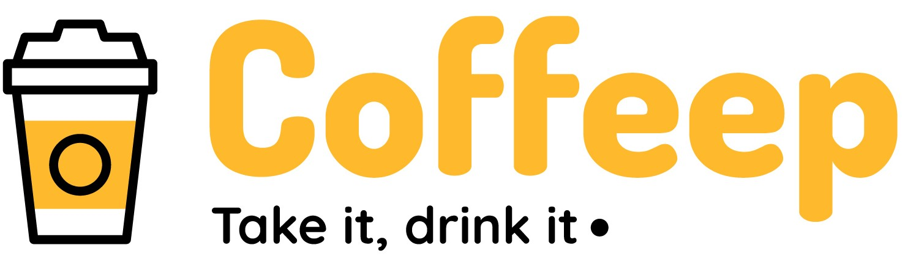

# CoffeeUp Mobile Application

<div align="center">



A modern mobile application for seamless coffee ordering and management.

[](https://reactnative.dev/)
[](https://expo.dev/)
[](https://www.typescriptlang.org/)

</div>

## Table of Contents
- [Overview](#overview)
- [Tech Stack](#tech-stack)
- [Project Structure](#project-structure)
- [Features](#features)
- [Getting Started](#getting-started)
- [Development](#development)
- [Environment Setup](#environment-setup)
- [Contributing](#contributing)

## Overview
CoffeeUp is a sophisticated mobile application engineered with React Native and Expo, delivering an exceptional coffee ordering experience. The application features:

- 🔐 Secure authentication system
- 🛍️ Comprehensive order management
- 💳 Integrated payment processing
- 📱 Modern, responsive UI/UX

## Tech Stack

| Category | Technology |
|----------|------------|
| Framework | React Native with Expo |
| Navigation | Expo Router |
| State Management | React Context API |
| HTTP Client | Axios |
| Authentication | JWT |
| Payment Gateway | Paystack |
| Local Storage | AsyncStorage |
| Language | TypeScript |

## Project Structure

```
coffeeup/
├── app/                    # Main application code
│   ├── (auth)/            # Authentication screens
│   ├── (tabs)/            # Main tab navigation
│   └── (details)/         # Detail screens
├── components/            # Reusable UI components
├── context/              # Global state management
├── types/                # TypeScript type definitions
├── utils/                # Utility functions
├── constants/            # Application constants
├── hooks/                # Custom React hooks
└── assets/              # Static assets
```

## Features

### Authentication
- JWT-based secure authentication
- User registration and login
- Persistent session management

### 🛍️ Order Management
- Intuitive order browsing
- Real-time order tracking
- Comprehensive order history
- Order details view

### 💳 Payment Integration
- Secure Paystack integration
- Real-time total calculation


### 📱 User Interface
- Modern, intuitive design
- Tab-based navigation
- Responsive layouts
- Loading states
- Error handling

## Getting Started

### Prerequisites
- Node.js (v14 or higher)
- npm or yarn
- Expo CLI
- iOS Simulator (Mac) / Android Studio (Windows/Linux)

### Installation

1. Clone the repository
   ```bash
   git clone https://github.com/Syntacticdev/CoffeeUp-Mobile-Application.git
   cd coffeeup
   ```

2. Install dependencies
   ```bash
   npm install
   ```

3. Configure environment variables
   ```bash
   .env
   # Edit .env with your configuration
   ```

### Running the Application

```bash
# Development server
npm start

# Platform-specific commands
npm run ios     # iOS
npm run android # Android
npm run web     # Web
```

### State Management
- Utilize Context API for global state
- Implement proper state updates
- Handle loading and error states
- Maintain state immutability

## Environment Setup

Required environment variables:

| Variable | Description |
|----------|-------------|
| `EXPO_PUBLIC_DB_URI` | Backend API URL |
| `EXPO_PUBLIC_PAYSTACK_KEY` | Paystack public key |
| `EXPO_PUBLIC_BILLING_EMAIL` | Billers email |

## Contributing

1. Fork the repository
2. Create your feature branch (`git checkout -b feature/AmazingFeature`)
3. Commit your changes (`git commit -m 'Add some AmazingFeature'`)
4. Push to the branch (`git push origin feature/AmazingFeature`)
5. Open a Pull Request


